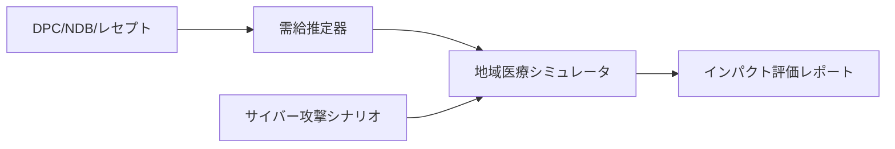

# plan2.md — 図表挿入機能（Mermaid→SVG + テキストボックス）実装計画

## 1. 目的

研究計画本文（主に様式1-2）に以下を埋め込めるようにする:

1. **Mermaid 図**（flowchart, sequence など）— `.mmd` ソースからビルド時に SVG 生成
2. **既存画像**（.jpg / .png / .svg）— 直接参照
3. 配置方式は **テキストボックス（`wp:anchor + wps:wsp`）**。
   - 参考プロジェクト `next-gen-comp-paper` のパターンをそのまま移植する
   - Mermaid→SVG 変換は `auto-eth-paper` の `docker/mermaid-svg/` コンテナを流用する

既存の申請書生成パイプライン（`fill_forms.py` → `build_narrative.sh` → `inject_narrative.py` → `roundtrip.sh`）を破壊しないこと。

## 2. 設計方針

### 2.1 既存 inject_narrative.py との親和性

`main/step02_docx/inject_narrative.py` は既に:

- 画像 rId のリナンバリング（`merge_rels`, `_COPY_REL_TYPES = {image, hyperlink}`）
- メディアファイルコピー（`copy_media` — 衝突時は `*_nN` にリネーム）
- `[Content_Types].xml` のマージ（`merge_content_types`）
- ルートタグ保存／復元（`extract_root_tag` / `restore_root_tag`）

に対応済みである。**narrative docx 内にテキストボックス／SVG が存在しても、inject 側は手を入れずに透過的に運搬できる見込み**。本計画で追加するのは「narrative docx に図が入る**前段**の処理」だけ。

### 2.2 Markdown 記法（執筆者インタフェース）

`next-gen-comp-paper/src/paper.md` と同じ記法を踏襲する:

```markdown
::: {.textbox width="80mm" height="55mm" pos-x="0mm" pos-y="0mm" anchor-h="column" anchor-v="paragraph" wrap="square" behind="false" valign="top"}
{#fig:overview}
:::
```

**様式1-2 固有の調整**:

- `anchor-h` / `anchor-v` の既定は用途別:
  - 本文フロー内に組み込む場合: **`column` / `paragraph`**（デモはこちら）
  - 余白に逃がす場合: **`margin` / `paragraph`**
  - paper プロジェクトの `page` 既定は固定レイアウト想定で不適なので使わない
- `relocate_textbox_by_page()` は **使用しない**（`--no-relocate` フラグで抑止）。申請書は自然なフロー配置のほうが安定
- `behind=false` 既定（paper 版は `true` だが、申請書は裏表紙の装飾目的ではなく図そのもの）

### 2.3 mmd 前処理

`main/step01_narrative/figs/*.mmd` をビルド時に検出し、同名の `*.svg` を生成する。生成済みなら（mtime 比較で）スキップ。

## 3. ディレクトリ構成（追加分）

```
med-resist-grant/
├── .gitignore                          # 改修: figs/*.svg をビルド成果物として除外（.mmd は管理）
├── docker/
│   └── mermaid-svg/                    # 新規コンテナ（auto-eth-paperより移植）
│       ├── Dockerfile                  # node:20-slim + chromium + mmdc + fonts-noto-cjk
│       │                               # （inkscape は不要なので除外する）
│       ├── convert-mermaid.sh          # .mmd → .svg（既存 .pdf 版を改変）
│       └── puppeteer-config.json
├── filters/                            # 新規ディレクトリ
│   └── textbox-minimal.lua             # 新規。.textbox Div のみ処理する最小 lua フィルタ
├── main/
│   ├── step01_narrative/
│   │   ├── figs/
│   │   │   ├── bg_hospital.jpg         # 既存（デモ用）
│   │   │   └── fig1_overview.mmd       # 新規（デモ用 mermaid）
│   │   └── youshiki1_2.md              # 既存。テキストボックスブロックを追記
│   └── step02_docx/
│       ├── wrap_textbox.py             # 新規（next-gen-comp-paperより移植・簡略化）
│       └── build_narrative.sh          # 既存を改修（mmd→svg前処理 + lua filter + wrap_textbox 後処理を追加）
```

**.gitignore 方針**:
- `main/step01_narrative/figs/*.mmd` は git 管理（ソース）
- `main/step01_narrative/figs/*.svg` は git 管理しない（.mmd からのビルド生成物）
- ただし pandoc/Word を介さず手で作った非 mermaid SVG（手書きベクタ等）を将来追加する場合は、ファイル名規約で区別するか個別 `!figs/手書き名.svg` で除外解除する

## 4. データフロー

```
[*.mmd files]                                  [*.jpg / *.png / *.svg files]
      │                                                   │
      ▼  (docker/mermaid-svg: mmdc -o *.svg)              │
[figs/*.svg] ─────────────────────────────────────────────┤
                                                          ▼
                                           [main/step01_narrative/youshiki1_2.md]
                                                          │
                                  pandoc --lua-filter=filters/textbox-minimal.lua
                                                          ▼
                                 [output/youshiki1_2_narrative.docx]
                                                          │
                            python main/step02_docx/wrap_textbox.py --source youshiki1_2.md
                                                          ▼
                 [output/youshiki1_2_narrative.docx]  ← テキストボックスに整形済み
                                                          │
                                  (以下は既存パイプライン、無改変)
                                                          ▼
                            python main/step02_docx/inject_narrative.py
                                                          ▼
                              [output/youshiki1_5_filled.docx]
```

## 5. コンテナ設計

### 5.1 `docker/mermaid-svg/Dockerfile`

`auto-eth-paper/docker/mermaid-svg/Dockerfile` をベースに以下を変更:

- **`inkscape` を除外**（SVG 出力では不要、イメージサイズ削減）
- **`ENV HOME=/tmp` を追加**（任意 UID 実行時に puppeteer/chromium が `$HOME/.config` に書き込めるように）

`node:20-slim + chromium + fonts-noto-cjk + ipafont + mermaid-cli` を含む。

### 5.2 `docker/mermaid-svg/convert-mermaid.sh`

出力を **.pdf → .svg** に変更する（1行修正のみ）:

```bash
# before
mmdc -i '$MMD_FILENAME' -o '$BASE_NAME.pdf' -p /etc/puppeteer-config.json -f
# after
mmdc -i '$MMD_FILENAME' -o '$BASE_NAME.svg' -p /etc/puppeteer-config.json
```

イメージ名は `med-resist-mermaid` にリネーム（他プロジェクトとの衝突回避）。

### 5.3 docker-compose への追加

`docker/docker-compose.yml` に `mermaid` サービスを追加:

```yaml
services:
  python:   # 既存
    ...
  mermaid:  # 追加
    build:
      context: ./mermaid-svg
      dockerfile: Dockerfile
    volumes:
      - ..:/workspace
    working_dir: /workspace
    environment:
      - HOME=/tmp                                       # 任意 UID 実行時の puppeteer/chromium 対策（既存 python サービスと同じ）
      - PUPPETEER_SKIP_CHROMIUM_DOWNLOAD=true
      - PUPPETEER_EXECUTABLE_PATH=/usr/bin/chromium
```

**`HOME=/tmp` の必須性**: `-u $(id -u):$(id -g)` で起動した場合、コンテナ内に該当 UID のホームディレクトリは存在しない。puppeteer/chromium は `$HOME/.config` や `$HOME/.cache` に書き込もうとして起動失敗する（ENOENT/EACCES）。既存 `python` サービスが `HOME=/tmp` で回避しているのと同じ理由で必須。

## 6. Lua フィルタ（`filters/textbox-minimal.lua`）

`next-gen-comp-paper/filters/jami-style.lua` から以下**のみ**を抽出する最小版を新規作成:

- `to_emu()` — 寸法文字列→EMU変換
- `textbox_marker()` — `TextBoxMarker` RawBlock 生成
- `process_textbox()` — `.textbox` Div を START/END マーカーで囲む
- **`Pass 1: SVG リネーム`** — 移植元と同様に **`Image src` を `.svg → .svg.png` に書き換える**（primary blip を必ず PNG にし、SVG は `asvg:svgBlob` 拡張で追加する 2 枚構成を維持）

**削除する処理**:

- `JSEK本文` custom-style による全 Para ラップ（既存 Pandoc の BodyText スタイルを尊重）
- OrderedList の手動番号化
- `.grid` Div の GRID_TABLE マーカー（申請書では使わない）

実質 80〜100 行程度。

**SVG → svg.png リネームを残す理由**: pandoc 3.6.x の docx writer は SVG 入力時に primary blip を SVG にする実装と PNG にする実装が混在しており、Word 側で「primary blip が SVG だと unknown blip format になる」ケースが報告されている。primary blip は必ず PNG（rsvg-convert 経由）にし、`asvg:svgBlob` 拡張で SVG を追加する移植元の二段構成が最も安全。これに伴い `docker/python/Dockerfile` に `librsvg2-bin`（`rsvg-convert`）の追加が必要（§5.4 参照）。

### 5.4 `docker/python/Dockerfile` への `librsvg2-bin` 追加

primary blip 用の PNG を生成するため `librsvg2-bin` を追加し、`build_narrative.sh` の Phase A の後段で `figs/*.svg` から同名の `figs/*.svg.png`（300dpi）を生成する。

## 7. wrap_textbox.py（`main/step02_docx/wrap_textbox.py`）

`next-gen-comp-paper/scripts/wrap-textbox.py` から以下**のみ**を移植:

| 保持 | 省略 |
|------|------|
| `extract_root_tag` / `restore_root_tag` | `apply_booktabs_borders` |
| `is_textbox_marker` / `parse_attrs` | `_set_cell_borders` / `_apply_booktabs_to_table` |
| `resize_images_in_content` | `relocate_textbox_by_page` |
| `build_textbox_paragraph` | `resize_tables_in_content`（テキストボックス内テーブルは現状ユースケースなしのため削除） |
| `embed_svg_native`（**パス解決を修正**） |  |
| `process_docx`（`--no-relocate` 既定） |  |

分量は 400〜500 行程度。`process_docx()` のエントリポイントは既存パイプラインから呼び出せる形にする:

```bash
python main/step02_docx/wrap_textbox.py \
    --source main/step01_narrative/youshiki1_2.md \
    --docpr-id-base 3000 \
    main/step02_docx/output/youshiki1_2_narrative.docx
```

### 7.1 `embed_svg_native` のパス解決バグ修正（**必須**）

移植元の `embed_svg_native()` は Markdown 内の image path をそのまま CWD 基準でオープンしている:

```python
# 移植元 — CWD 依存で壊れる
svg_full_path = svg_path                # e.g. "figs/foo.svg"
if not os.path.isfile(svg_full_path):
    print(f"  Warning: SVG file not found: {svg_full_path}")
    continue
```

`build_narrative.sh` は `cd "$PROJECT_ROOT"` 後に wrap_textbox を呼ぶため、CWD 基準では `figs/foo.svg` は見つからず、**SVG ネイティブ埋込が全件 silent に失敗する**（warning だけ出して exit 0）。必ず以下のように **`source_md` の親ディレクトリ基準で resolve** すること:

```python
src_dir = os.path.dirname(os.path.abspath(source_md_path))
svg_full_path = os.path.normpath(os.path.join(src_dir, svg_path))
if not os.path.isfile(svg_full_path):
    raise FileNotFoundError(f"SVG referenced in {source_md_path} not found: {svg_full_path}")
```

さらに **未検出時は warning ではなく FileNotFoundError を上げて非ゼロ exit** にし、CI で確実に検知できるようにする。

### 7.2 `wp:docPr/@id` 採番ベース（`--docpr-id-base`）

`build_textbox_paragraph()` 内で `docPr@id` に `id_base + z_order` を割り当てる。`--docpr-id-base` 引数で外部から指定可能とし、デフォルトは **3000**（テンプレート docx の既存 docPr@id 帯が 1〜200 程度であることを Prompt 10-1 で確認したうえで、十分離れた値）。

build_narrative.sh からは:

- 様式1-2 narrative → `--docpr-id-base 3000`
- 様式1-3 narrative → `--docpr-id-base 4000`

を渡し、両 narrative を inject_narrative.py で結合した後でも docPr@id が一意になるようにする。

### 7.3 SVG ネイティブ埋込（`embed_svg_native`）

`a:blip > a:extLst > a:ext > asvg:svgBlob` を追加する Office 2016+ の仕組み。primary blip は §6 の svg→svg.png リネームにより PNG が割り当てられているので、**primary が PNG・拡張が SVG という安全な二段構成**になる。

| ビューア | 表示する画像 |
|---------|-------------|
| Word 2016+ | asvg:svgBlob（ベクタ） |
| Word 2013 以下 | primary blip = PNG（フォールバック） |
| LibreOffice | primary blip = PNG |

これにより Word バージョン依存・LO 依存どちらにも頑健になる。

## 8. build_narrative.sh の改修

既存スクリプトに以下のフェーズを挿入する（順序が重要）:

```bash
# (既存) reference.docx の生成とスタイル設定

# (新規) Phase A: mermaid → svg → svg.png（md ループの外で 1 回だけ実行）
shopt -s nullglob
mmd_files=( main/step01_narrative/figs/*.mmd )
shopt -u nullglob

for mmd in "${mmd_files[@]}"; do
    svg="${mmd%.mmd}.svg"
    if [[ ! -f "$svg" || "$mmd" -nt "$svg" ]]; then
        docker compose -f docker/docker-compose.yml run --rm \
            -u "$(id -u):$(id -g)" mermaid \
            mmdc -i "$mmd" -o "$svg" -p /etc/puppeteer-config.json
    fi
done

# Phase A 後段: figs/*.svg → figs/*.svg.png（primary blip 用フォールバック PNG）
shopt -s nullglob
svg_files=( main/step01_narrative/figs/*.svg )
shopt -u nullglob
for svg in "${svg_files[@]}"; do
    png="${svg}.png"  # foo.svg.png — Lua フィルタの命名規約と一致
    if [[ ! -f "$png" || "$svg" -nt "$png" ]]; then
        run_python_or_rsvg "$svg" "$png"
    fi
done

# (既存) Phase B: pandoc 変換
#   変更点: --lua-filter=filters/textbox-minimal.lua を追加
#   Lua フィルタ内の Pass 1 で .svg → .svg.png にリネームされ、primary blip は PNG 経路になる
pandoc "$src" "${PANDOC_OPTS[@]}" \
    --lua-filter=filters/textbox-minimal.lua \
    --output="$out"

# (新規) Phase C: wrap_textbox 後処理
#   --docpr-id-base は narrative 別に分離（M09-02 対策）
case "$src" in
    *youshiki1_2.md) base=3000 ;;
    *youshiki1_3.md) base=4000 ;;
    *)               base=5000 ;;
esac
run_python main/step02_docx/wrap_textbox.py \
    --source "$src" --docpr-id-base "$base" "$out"
```

**重要なポイント**:

- **`shopt -s nullglob`** は `set -euo pipefail` 環境下で `.mmd`/`.svg` がゼロ件のときにリテラル glob 文字列がループに渡るのを防ぐ。これがないと dummy E2E（図なし）が確実に fail する。
- **Phase A は md ループの外で 1 回だけ実行**する。md ごとに mmd→svg を回すと同一 svg を複数回ビルドする無駄が生じる。
- **`--docpr-id-base` の narrative 別分離** により、将来 1-2 と 1-3 の両方に図を入れた場合でも inject 後の docPr@id 重複（M09-02）を防止する。

**非破壊性**: `.textbox` Div を 1 つも含まない Markdown の場合、lua フィルタは何も出力せず、wrap_textbox.py は `No TextBoxMarker regions found` を出して終了する。**既存の youshiki1_2.md / youshiki1_3.md（現時点で図なし）は一切影響を受けない**。

## 9. 既存 inject_narrative.py との連携検証

inject_narrative.py は narrative docx 内の `w:drawing`（= テキストボックス anchor 含む）を body 要素としてそのままコピーする。確認すべきは以下の 4 点:

1. **rels マージ**: `merge_rels` の `_COPY_REL_TYPES` は `image` と `hyperlink` のみ。テキストボックス内の SVG `asvg:svgBlob` の `r:embed` も image 型 rels なので問題なし
2. **r:id 属性網羅**: `merge_rels` は `r:id` / `r:embed` / `r:link` の 3 属性を検索。`asvg:svgBlob` は `r:embed` を使うのでカバー済み
3. **content types**: narrative docx が svg を追加していれば Default extension = svg が含まれる。`merge_content_types` が取り込むので OK
4. **名前空間 prefix の保存**: `asvg`（`http://schemas.microsoft.com/office/drawing/2016/SVG/main`）と `a14`（`http://schemas.microsoft.com/office/drawing/2010/main`）を `inject_narrative.py:NSMAP` に追加し `ET.register_namespace` 済みであること。これがないと ElementTree 再シリアライズ時に `ns0` 等の自動 prefix に置き換わり、Word 標準と乖離する。**現時点で対応済み**（report09 M09-04 対応）

### 9.1 想定スコープと前提

- **本計画のスコープ**: 図表は **様式1-2 のみ** に挿入する想定。
- **1-3 にも図を挿入したくなった場合**: `wrap_textbox.py --docpr-id-base` を narrative 別に分離してあるので docPr@id 衝突は起こらない（§8 参照）。ただし inject_narrative.py 自体は body 内の docPr@id を再採番しないため、`--docpr-id-base` を渡し忘れると重複する。Prompt 10-3 と Prompt 10-5 で必ず検証。

→ **inject_narrative.py の改修は最小限**（NSMAP に asvg/a14 追加のみ）。実装完了後 E2E で再検証する。

## 10. デモ挿入内容

`main/step01_narrative/youshiki1_2.md` に、既存本文を壊さずに以下を追加（§2.2 の本文フロー内既定 `anchor-h="column" anchor-v="paragraph"` を使用）:

```markdown
::: {.textbox width="90mm" height="60mm" pos-x="0mm" pos-y="0mm" anchor-h="column" anchor-v="paragraph" wrap="square" behind="false"}
{#fig:hospital}
:::
```

および、新規 mermaid デモ:

```markdown
::: {.textbox width="120mm" height="70mm" pos-x="0mm" pos-y="0mm" anchor-h="column" anchor-v="paragraph" wrap="square" behind="false"}
{#fig:overview}
:::
```

`fig1_overview.mmd` は Prompt 10-4 で新規作成する。内容例:



## 11. 検証計画

1. **単体**: `mmdc` で fig1 が SVG に変換される（コンテナ内）
2. **pandoc**: lua フィルタ適用後の intermediate docx に `TextBoxMarker` 段落が含まれる
3. **wrap_textbox**: 最終 narrative docx を unzip し `word/document.xml` に `wp:anchor` と `asvg:svgBlob` が存在する
4. **primary blip 形式**: `word/media/` 配下に `image*.png`（rsvg-convert 由来 PNG）と `svg*.svg` の両方が存在し、`a:blip/@r:embed` は PNG を、`asvg:svgBlob/@r:embed` は SVG を指していること
5. **inject**: `youshiki1_5_filled.docx` に上記要素が運搬されていることを `xmllint` で確認
6. **docPr@id 一意性**: `youshiki1_5_filled.docx` の `word/document.xml` 内で `wp:docPr/@id` が全件ユニーク（特に 1-2 と 1-3 の両方に図がある場合の重複検査）
7. **LibreOffice レンダリング**（参考）: `libreoffice --headless --convert-to pdf` で PDF 化し、PDF 内に画像が描画されていること（`pdfimages -list` で確認）。LO は primary blip = PNG を表示するため、これだけでは Word での asvg レンダリングは検証されない
8. **Windows Word COM レンダリング**（**本番合否判定**）: `scripts/roundtrip.sh` を経由して Google Drive 同期 → Windows `watch-and-convert.ps1` → Word COM → PDF を生成し、生成 PDF 内で SVG（ベクタ）が表示されることを目視確認。LO 検証が通っても Windows 側で崩れるパターン（asvg レンダリング不具合、フォント代替、`anchor-v="paragraph"` の挙動差）はここでしか検出できない
9. **サイズ**: 最終 PDF が 10MB 未満、目標 3MB 未満
10. **非破壊**: デモブロックを除去した場合に既存 E2E（`DATA_DIR=data/dummy`）が引き続き通過すること

**判定方針**: 5〜8 のうち **8（Windows Word PDF）を本番合否判定の主軸**とする。LO 検証（7）は早期失敗検知用の参考扱い。LO で通って Win で失敗するケースが想定される以上、両方を回す。

## 12. リスクと未決事項

| リスク | 対策 |
|-------|-----|
| **`embed_svg_native` が CWD 依存で SVG を見つけられず silent fail** | §7.1 のとおり `source_md` 親ディレクトリ基準で resolve、未検出は `FileNotFoundError` で非ゼロ exit |
| **wp:docPr/@id が narrative 1-2/1-3 間で重複** | §7.2 の `--docpr-id-base` を narrative 別に分離（1-2=3000, 1-3=4000）、§11 検証6で一意性検査 |
| **mermaid 任意 UID 実行で puppeteer/chromium が起動しない** | §5.1/§5.3 で Dockerfile と compose の両方に `HOME=/tmp` を設定 |
| **inject_narrative.py の名前空間 prefix 自動リネーム** | NSMAP に `asvg`/`a14` 追加済み（M09-04 対応） |
| **LO 検証だけでは Windows Word の asvg レンダリングを検証できない** | §11 検証8 で `roundtrip.sh` 経由 Win Word PDF を本番合否判定の主軸とする |
| **build_narrative.sh Phase A の bash glob ゼロ件失敗** | §8 のとおり `shopt -s nullglob` で囲む |
| **pandoc 3.6 の primary blip 形式（SVG/PNG）がビルドにより混在** | §6 で svg→svg.png リネーム Pass 1 を維持し、primary は必ず PNG。`librsvg2-bin` を docker/python/Dockerfile に追加 |
| mermaid-cli の chromium サンドボックスが host で起動しない | `puppeteer-config.json` の `--no-sandbox` 設定を継承 |
| 日本語フォントが SVG に埋め込まれない | fonts-noto-cjk + fonts-ipafont を Dockerfile に同梱済み |
| `anchor-v="paragraph"` で位置が意図せず動く | `wrap="square"`/`"tight"` を既定として流し込み、執筆者が必要に応じて `pos-y` で微調整 |
| 既存 Markdown の `` 直接参照が lua フィルタを通さないため位置制御できない | 原則 `.textbox` Div で囲むルールを README に明記 |
| Word 2016 未満環境ではネイティブ SVG が表示されない | §7.3 の primary=PNG / 拡張=SVG 二段構成で Word 2013 でもフォールバック表示可 |
| Windows 側 watch-and-convert.ps1 で SVG 入り docx が破壊される | §11 検証8 で実地確認。発見時は wrap_textbox の構造を見直す |
| `roundtrip.sh` の rclone push/pull で SVG メディアが運搬されない | docx は単一 ZIP なので rclone copy で完全運搬される（既存実績あり） |
| mermaid Docker イメージのビルド時間（初回 ~5分） | `./scripts/build.sh mermaid-build` サブコマンドで事前ビルドを提供 |
| Phase A のコンテナ起動オーバヘッド（N 図で N 倍） | 当面は許容。図が増えたら 1 コンテナで複数 .mmd を回すラッパを用意 |

## 13. ステップ・バイ・ステップ実装順序

| Prompt | 内容 | 依存 |
|--------|------|------|
| 10-1 | mermaid-svg コンテナ追加（`docker/mermaid-svg/`、docker-compose.yml 更新） | なし |
| 10-2 | `filters/textbox-minimal.lua` と `main/step02_docx/wrap_textbox.py` 新規作成 | なし |
| 10-3 | `build_narrative.sh` に mmd→svg 前処理 + lua filter + wrap_textbox 後処理を統合 | 10-1, 10-2 |
| 10-4 | デモ画像＆mermaid の `youshiki1_2.md` 挿入、単体ビルド動作確認 | 10-3 |
| 10-5 | inject 連携の E2E 検証、PDF 生成、既存非破壊性の確認 | 10-4 |

各 Prompt は `docs/prompts.md` に記載する。
