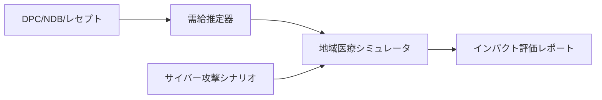

# plan2.md — 図表挿入機能（Mermaid→SVG + テキストボックス）実装計画

## 1. 目的

研究計画本文（主に様式1-2）に以下を埋め込めるようにする:

1. **Mermaid 図**（flowchart, sequence など）— `.mmd` ソースからビルド時に SVG 生成
2. **既存画像**（.jpg / .png / .svg）— 直接参照
3. 配置方式は **テキストボックス（`wp:anchor + wps:wsp`）**。
   - 参考プロジェクト `next-gen-comp-paper` のパターンをそのまま移植する
   - Mermaid→SVG 変換は `auto-eth-paper` の `docker/mermaid-svg/` コンテナを流用する

既存の申請書生成パイプライン（`fill_forms.py` → `build_narrative.sh` → `inject_narrative.py` → `roundtrip.sh`）を破壊しないこと。

## 2. 設計方針

### 2.1 既存 inject_narrative.py との親和性

`main/step02_docx/inject_narrative.py` は既に:

- 画像 rId のリナンバリング（`merge_rels`, `_COPY_REL_TYPES = {image, hyperlink}`）
- メディアファイルコピー（`copy_media` — 衝突時は `*_nN` にリネーム）
- `[Content_Types].xml` のマージ（`merge_content_types`）
- ルートタグ保存／復元（`extract_root_tag` / `restore_root_tag`）

に対応済みである。**narrative docx 内にテキストボックス／SVG が存在しても、inject 側は手を入れずに透過的に運搬できる見込み**。本計画で追加するのは「narrative docx に図が入る**前段**の処理」だけ。

### 2.2 Markdown 記法（執筆者インタフェース）

`next-gen-comp-paper/src/paper.md` と同じ記法を踏襲する:

```markdown
::: {.textbox width="80mm" height="55mm" pos-x="100mm" pos-y="40mm" anchor-h="margin" anchor-v="paragraph" wrap="tight" behind="false" valign="top"}
{#fig:overview}
:::
```

**様式1-2 固有の調整**:

- `anchor-h` / `anchor-v` は **`margin` / `paragraph`** を既定にする（paper プロジェクトの `page` 既定は固定レイアウト想定で不適）
- `relocate_textbox_by_page()` は **使用しない**（`--no-relocate` フラグで抑止）。申請書は自然なフロー配置のほうが安定
- `behind=false` 既定（paper 版は `true` だが、申請書は裏表紙の装飾目的ではなく図そのもの）

### 2.3 mmd 前処理

`main/step01_narrative/figs/*.mmd` をビルド時に検出し、同名の `*.svg` を生成する。生成済みなら（mtime 比較で）スキップ。

## 3. ディレクトリ構成（追加分）

```
med-resist-grant/
├── docker/
│   └── mermaid-svg/                    # 新規コンテナ（auto-eth-paperより移植）
│       ├── Dockerfile                  # node:20-slim + chromium + mmdc + fonts-noto-cjk
│       ├── convert-mermaid.sh          # .mmd → .svg（既存 .pdf 版を改変）
│       └── puppeteer-config.json
├── filters/                            # 新規ディレクトリ
│   └── textbox-minimal.lua             # 新規。.textbox Div のみ処理する最小 lua フィルタ
├── main/
│   ├── step01_narrative/
│   │   ├── figs/
│   │   │   ├── bg_hospital.jpg         # 既存（デモ用）
│   │   │   └── fig1_overview.mmd       # 新規（デモ用 mermaid）
│   │   └── youshiki1_2.md              # 既存。テキストボックスブロックを追記
│   └── step02_docx/
│       ├── wrap_textbox.py             # 新規（next-gen-comp-paperより移植・簡略化）
│       └── build_narrative.sh          # 既存を改修（mmd→svg前処理 + lua filter + wrap_textbox 後処理を追加）
```

## 4. データフロー

```
[*.mmd files]                                  [*.jpg / *.png / *.svg files]
      │                                                   │
      ▼  (docker/mermaid-svg: mmdc -o *.svg)              │
[figs/*.svg] ─────────────────────────────────────────────┤
                                                          ▼
                                           [main/step01_narrative/youshiki1_2.md]
                                                          │
                                  pandoc --lua-filter=filters/textbox-minimal.lua
                                                          ▼
                                 [output/youshiki1_2_narrative.docx]
                                                          │
                            python main/step02_docx/wrap_textbox.py --source youshiki1_2.md
                                                          ▼
                 [output/youshiki1_2_narrative.docx]  ← テキストボックスに整形済み
                                                          │
                                  (以下は既存パイプライン、無改変)
                                                          ▼
                            python main/step02_docx/inject_narrative.py
                                                          ▼
                              [output/youshiki1_5_filled.docx]
```

## 5. コンテナ設計

### 5.1 `docker/mermaid-svg/Dockerfile`

`auto-eth-paper/docker/mermaid-svg/Dockerfile` をそのまま使用（変更なし）。`node:20-slim + chromium + fonts-noto-cjk + ipafont + mermaid-cli` を含む。

### 5.2 `docker/mermaid-svg/convert-mermaid.sh`

出力を **.pdf → .svg** に変更する（1行修正のみ）:

```bash
# before
mmdc -i '$MMD_FILENAME' -o '$BASE_NAME.pdf' -p /etc/puppeteer-config.json -f
# after
mmdc -i '$MMD_FILENAME' -o '$BASE_NAME.svg' -p /etc/puppeteer-config.json
```

イメージ名は `med-resist-mermaid` にリネーム（他プロジェクトとの衝突回避）。

### 5.3 docker-compose への追加

`docker/docker-compose.yml` に `mermaid` サービスを追加:

```yaml
services:
  python:   # 既存
    ...
  mermaid:  # 追加
    build:
      context: ./mermaid-svg
      dockerfile: Dockerfile
    volumes:
      - ..:/workspace
    working_dir: /workspace
    environment:
      - PUPPETEER_SKIP_CHROMIUM_DOWNLOAD=true
      - PUPPETEER_EXECUTABLE_PATH=/usr/bin/chromium
```

## 6. Lua フィルタ（`filters/textbox-minimal.lua`）

`next-gen-comp-paper/filters/jami-style.lua` から以下**のみ**を抽出する最小版を新規作成:

- `to_emu()` — 寸法文字列→EMU変換
- `textbox_marker()` — `TextBoxMarker` RawBlock 生成
- `process_textbox()` — `.textbox` Div を START/END マーカーで囲む

**削除する処理**:

- `JSEK本文` custom-style による全 Para ラップ（既存 Pandoc の BodyText スタイルを尊重）
- OrderedList の手動番号化
- `.grid` Div の GRID_TABLE マーカー（申請書では使わない）
- Pass 1 の `.svg → .svg.png` リネーム（後述。Word 2016+ 前提で SVG ネイティブ埋込）

実質 40〜60 行程度に収まる見込み。

## 7. wrap_textbox.py（`main/step02_docx/wrap_textbox.py`）

`next-gen-comp-paper/scripts/wrap-textbox.py` から以下**のみ**を移植:

| 保持 | 省略 |
|------|------|
| `extract_root_tag` / `restore_root_tag` | `apply_booktabs_borders` |
| `is_textbox_marker` / `parse_attrs` | `_set_cell_borders` / `_apply_booktabs_to_table` |
| `resize_images_in_content` | `relocate_textbox_by_page` |
| `build_textbox_paragraph` |  |
| `embed_svg_native` |  |
| `process_docx`（`--no-relocate` 既定） |  |

分量は 400〜500 行程度。`process_docx()` のエントリポイントは既存パイプラインから呼び出せる形にする:

```bash
python main/step02_docx/wrap_textbox.py \
    --source main/step01_narrative/youshiki1_2.md \
    main/step02_docx/output/youshiki1_2_narrative.docx
```

**SVG ネイティブ埋込（`embed_svg_native`）**: `a:blip > a:extLst > a:ext > asvg:svgBlob` を追加する Office 2016+ の仕組み。現在の Windows 側 Word（>=2016）は対応済み。LibreOffice は `w:drawing` の primary blip（PNG/SVG の通常参照）を表示するので、SVG→ラスタ前変換は不要だが、**フォールバック用に `rsvg-convert` で 300dpi PNG を同時生成**しておくとよい（将来必要に応じて）。

## 8. build_narrative.sh の改修

既存スクリプトに以下のフェーズを挿入する（順序が重要）:

```bash
# (既存) reference.docx の生成とスタイル設定

# (新規) Phase A: mermaid → svg
for mmd in main/step01_narrative/figs/*.mmd; do
    svg="${mmd%.mmd}.svg"
    if [[ ! -f "$svg" || "$mmd" -nt "$svg" ]]; then
        docker compose -f docker/docker-compose.yml run --rm \
            -u "$(id -u):$(id -g)" mermaid \
            mmdc -i "$mmd" -o "$svg" -p /etc/puppeteer-config.json
    fi
done

# (既存) Phase B: pandoc 変換
#   変更点: --lua-filter=filters/textbox-minimal.lua を追加
pandoc "$src" "${PANDOC_OPTS[@]}" \
    --lua-filter=filters/textbox-minimal.lua \
    --output="$out"

# (新規) Phase C: wrap_textbox 後処理
python main/step02_docx/wrap_textbox.py --source "$src" "$out"
```

**非破壊性**: `.textbox` Div を 1 つも含まない Markdown の場合、lua フィルタは何も出力せず、wrap_textbox.py は `No TextBoxMarker regions found` を出して終了する。**既存の youshiki1_2.md / youshiki1_3.md（現時点で図なし）は一切影響を受けない**。

## 9. 既存 inject_narrative.py との連携検証

inject_narrative.py は narrative docx 内の `w:drawing`（= テキストボックス anchor 含む）を body 要素としてそのままコピーする。確認すべきは以下の 3 点:

1. **rels マージ**: `merge_rels` の `_COPY_REL_TYPES` は `image` と `hyperlink` のみ。テキストボックス内の SVG `asvg:svgBlob` の `r:embed` も image 型 rels なので問題なし
2. **r:id 属性網羅**: `merge_rels` は `r:id` / `r:embed` / `r:link` の 3 属性を検索。`asvg:svgBlob` は `r:embed` を使うのでカバー済み
3. **content types**: narrative docx が svg を追加していれば Default extension = svg が含まれる。`merge_content_types` が取り込むので OK

→ **inject_narrative.py の改修は不要** の見込み。実装完了後 E2E で再検証する。

## 10. デモ挿入内容

`main/step01_narrative/youshiki1_2.md` に、既存本文を壊さずに以下を追加:

```markdown
::: {.textbox width="90mm" height="60mm" pos-x="0mm" pos-y="0mm" anchor-h="column" anchor-v="paragraph" wrap="square" behind="false"}
{#fig:hospital}
:::
```

および、新規 mermaid デモ:

```markdown
::: {.textbox width="120mm" height="70mm" pos-x="0mm" pos-y="0mm" anchor-h="column" anchor-v="paragraph" wrap="square" behind="false"}
{#fig:overview}
:::
```

`fig1_overview.mmd` は Prompt 10-4 で新規作成する。内容例:



## 11. 検証計画

1. **単体**: `mmdc` で fig1 が SVG に変換される（コンテナ内）
2. **pandoc**: lua フィルタ適用後の intermediate docx に `TextBoxMarker` 段落が含まれる
3. **wrap_textbox**: 最終 narrative docx を unzip し `word/document.xml` に `wp:anchor` と `asvg:svgBlob` が存在する
4. **inject**: `youshiki1_5_filled.docx` に上記要素が運搬されていることを xmllint で確認
5. **レンダリング**: `libreoffice --headless --convert-to pdf` で PDF 化し、PDF 内に画像が描画されていること（`pdfimages -list` で確認）
6. **サイズ**: 最終 PDF が 10MB 未満、目標 3MB 未満
7. **非破壊**: デモブロックを除去した場合に既存 E2E（`DATA_DIR=data/dummy`）が引き続き通過すること

## 12. リスクと未決事項

| リスク | 対策 |
|-------|-----|
| mermaid-cli の chromium サンドボックスが host で起動しない | `puppeteer-config.json` の `--no-sandbox` 設定を継承 |
| 日本語フォントが SVG に埋め込まれない | fonts-noto-cjk + fonts-ipafont を Dockerfile に同梱済み |
| inject_narrative.py 側でテキストボックス番号ID（`wp:docPr/@id`）が衝突 | wrap_textbox は 1000 番台を使用。template が同帯を使っていないか Prompt 10-1 前に確認 |
| LibreOffice が SVG 内のテキスト配置をずらす | PNG フォールバック生成（`rsvg-convert -d 300`）を Prompt 10-5 のオプションとして用意 |
| `anchor-v="paragraph"` で位置が意図せず動く | `wrap="square"`/`"tight"` を既定として流し込み、執筆者が必要に応じて `pos-y` で微調整 |
| 既存 Markdown の `` 直接参照が lua フィルタを通さないため位置制御できない | 原則 `.textbox` Div で囲むルールを README に明記 |
| Word 2016 未満環境ではネイティブ SVG が表示されない | fallback PNG を同時埋め込みする将来 enhancement の余地あり（今回は対象外） |
| samba/mermaid Docker イメージのビルド時間（初回 ~5分） | `./scripts/build.sh mermaid-build` サブコマンドで事前ビルドを提供 |

## 13. ステップ・バイ・ステップ実装順序

| Prompt | 内容 | 依存 |
|--------|------|------|
| 10-1 | mermaid-svg コンテナ追加（`docker/mermaid-svg/`、docker-compose.yml 更新） | なし |
| 10-2 | `filters/textbox-minimal.lua` と `main/step02_docx/wrap_textbox.py` 新規作成 | なし |
| 10-3 | `build_narrative.sh` に mmd→svg 前処理 + lua filter + wrap_textbox 後処理を統合 | 10-1, 10-2 |
| 10-4 | デモ画像＆mermaid の `youshiki1_2.md` 挿入、単体ビルド動作確認 | 10-3 |
| 10-5 | inject 連携の E2E 検証、PDF 生成、既存非破壊性の確認 | 10-4 |

各 Prompt は `docs/prompts.md` に記載する。
